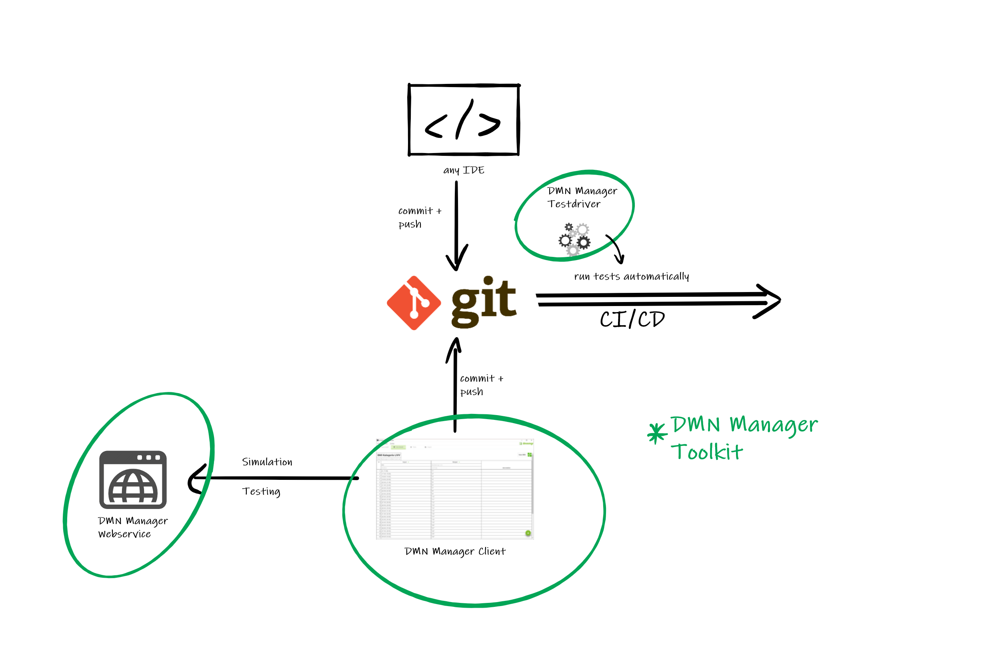
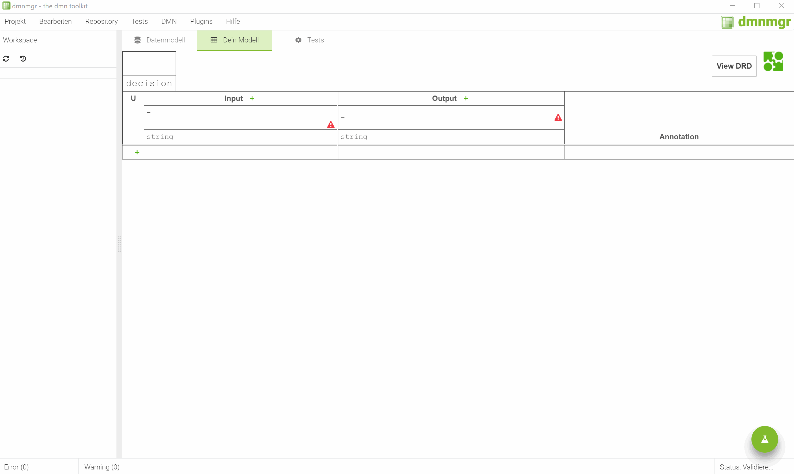
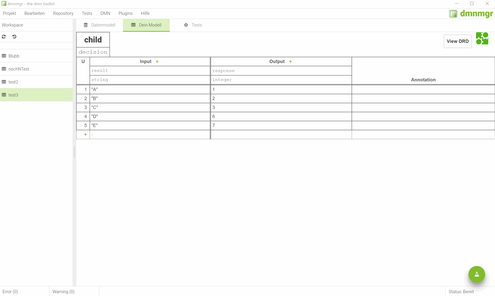
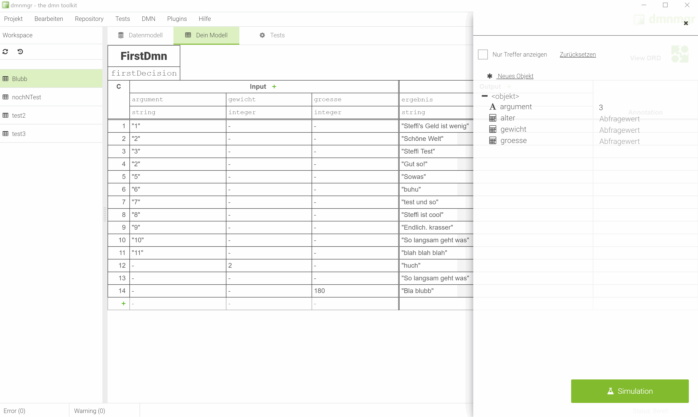

# dmnmgr-client

The DMN Manager is a toolkit incoperating the Camunda DMN implementation and providing
tools to develop DMN based applications in cross functional teams.

## General architecture

- The client application is used to visually define business rules, simulate decision models and write tests. (This repository)
- The server-side application provides web services to simulate decisions, run tests and validate DMN definitions. (https://github.com/davidibl/dmnmgr-server)
- The test driver is a java library to run tests defined in the DMN Manager client during CI/CD processes automatically. (https://github.com/davidibl/dmnmgr-server)

## Use

To use this toolkit, you need to download a prebuild release or checkout this repository and build it for yourself.

Build command:
`npm run electron:windows`

Serve from dev folder:
`npm run electron:serve` and in other console: `npm start`

The webservice is a Spring Boot application which can be executed directly on the client machine or on any server with java support.

The webservice is only needed to simulate decisions or to tests DMN business rules.

To use GIT support the standard GIT Client has to be installed on the machine.

### Configuration

To configure the DMN Manager client open the settings page (Bearbeiten -> Einstellungen || STRG + K).

On the settings page the base URL of the webservice and GIT credentials can be defined.

## Get started

After opening the tool, the modeling can just begin. Watch out, saving your dmn file will create a second file... The DMN Manager project file. In this file data definitions, test cases and test expectations are stored.

To use an existing DMN file, just use the 'DMN Datei importieren' function in the 'Project' menu.

## Contribution

Feel free to contribute and extend the repositories with your ideas to improve the workflow around DMN based rules editing.

## Functionality

- Input Data Definition

- Simulation

- DMN Validation

- Test definition and testing

- Basic Build-In GIT support

- Editing tools

